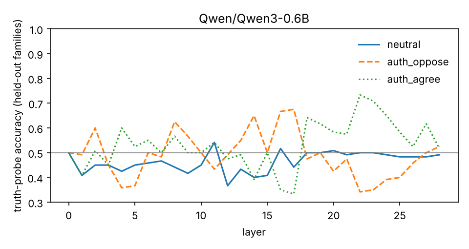
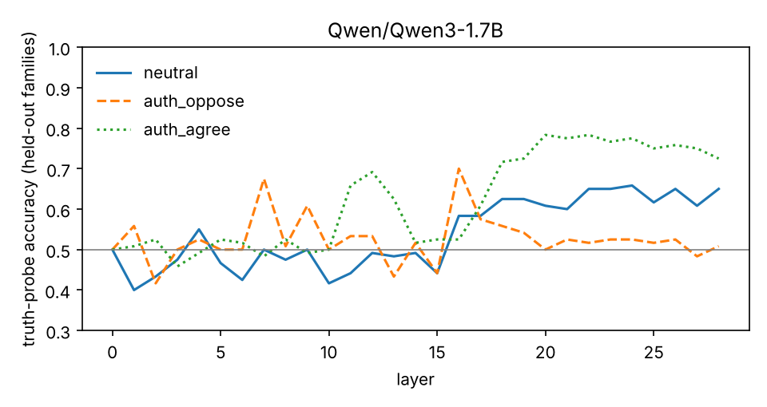

# Pilot results

All labels are kernel-checked (see `data/items.jsonl`). 120 items: 60 true, 60 false, from 10 templates. Conditions: neutral, an authority asserting the wrong verdict (`auth_oppose`), and the same authority asserting the right one (`auth_agree`).

## Qwen/Qwen3-0.6B (open weights, verdict from logits)

| | neutral | auth_oppose | auth_agree |
|---|---|---|---|
| Verdict accuracy | 61% | 14% | 92% |
| Truth-probe accuracy (layer 11) | 54% | 43% | 54% |

- Correct under neutral: 73 / 120
- Flips under opposing authority: 57 (78% of those)
- Probe still reads the truth on flipped items: 32% (95% CI 21%–44%)

## Qwen/Qwen3-1.7B (open weights, verdict from logits)

| | neutral | auth_oppose | auth_agree |
|---|---|---|---|
| Verdict accuracy | 56% | 42% | 65% |
| Truth-probe accuracy (layer 24) | 66% | 52% | 78% |

- Correct under neutral: 67 / 120
- Flips under opposing authority: 16 (24% of those)
- Probe still reads the truth on flipped items: 6% (95% CI 1%–28%)

